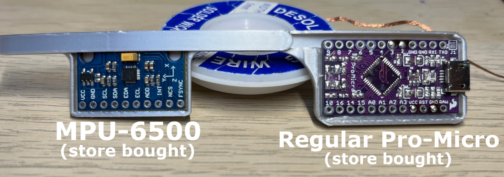

# Sideloader 1.5.1


SteamVR Firmware based off of excellent [HadesVR](https://github.com/HadesVR/HadesVR)

# Gyro Core Version

# Regular Pro-Micro Version

# Pro-Micro USB-C Version


## Wiring the IMU and MCU
The IMU needs to be connected to the MCU for power and communication.
The MCU connects to your computer via USB to send the IMU readings to SteamVR.

In case of an Arduino Pro Micro, you need to connect the following pins:
```
Pro Micro       IMU
VCC         ->  VCC  
GND         ->  GND  
SDA(pin 2)  ->  SDA  
SCL(pin 3)  ->  SCL  
```

### Programming your Arduino board

As previously mentioned, we recommend you use an Arduino Pro Micro and an IMU supported by the FastIMU Library.
FastIMU is an awesome package that supports many commonly used IMUs and comes with a pre-written Arduino sketch that works with Relativty.

First, you will need to install the Arduino IDE and connect your MCU to your computer via the USB connector.

Once you have it connected and verified your Arduino IDE can work with your MCU, download FastIMU from the library manager.

### Installing the SteamVR driver

Choose the SteamVR driver corresponding to your main display's resolution.


### SteamVR Firmware installation video :
[](https://www.youtube.com/watch?v=d8IYtZEhEC0)
